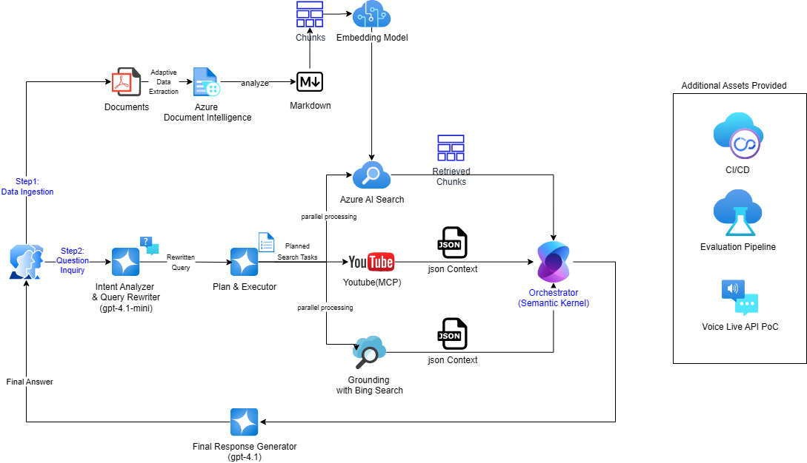
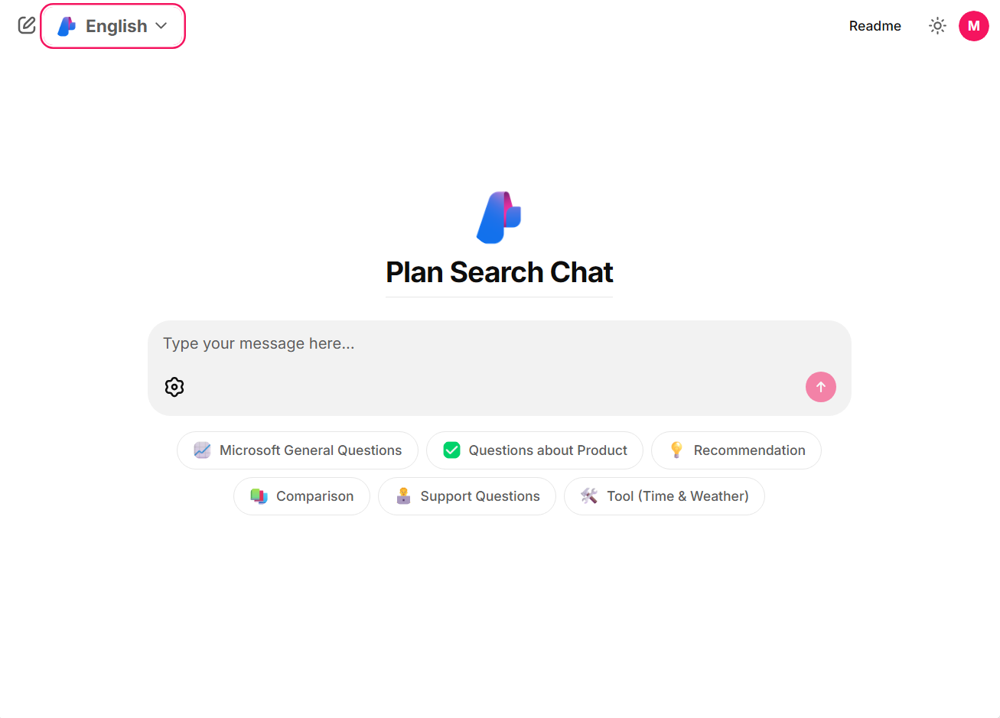

# plan-search-chatbot
This project is an assetized version of the general-inquiry-chatbot, originally developed by [@HakjunMIN](https://github.com/HakjunMIN), [@hyogrin](https://github.com/hyogrin) and [@YOONPYO](https://github.com/YOONPYOGitHub). It has been further developed to support users in exploring Microsoft products, comparing options, and receiving real-time assistance via a conversational interface.




## 🔥 New Features (6-Aug-2025)
I am excited to introduce several enhancements that significantly improve the functionality, flexibility, and developer experience of this project.

### 🧠 Semantic Kernel Integration
- The chatbot now incorporates [Semantic Kernel](https://github.com/microsoft/semantic-kernel), Microsoft's open-source orchestration SDK for LLM apps.
- Enables more intelligent planning and contextual understanding, resulting in richer, more accurate responses.
- Supports planner-based execution and native function calling for complex multi-step tasks.

### ⚡️ Parallel Agentic Flow
- Added support for **parallel processing** within agentic flows.
- Improves performance and responsiveness during multi-function execution.
- Ideal for scenarios requiring simultaneous API calls or concurrent reasoning steps.

### 📺 YouTube MCP Server Integration
- Supports both **MCP server** and **native API**-based function calling for YouTube data access.
- Enables seamless retrieval of YouTube content via pre-configured MCP endpoints or direct API calls.

### 🔍 Verbose Mode
- Introduced **verbose mode** for improved debugging and traceability.
- Logs include:
  - Raw input/output data
  - API call history
  - Function invocation details
- Helps track down issues and optimize prompt behavior.

### 🎨 UI Framework Selection
- Now supports both of the following UI frameworks:
  - [Chainlit](https://github.com/Chainlit/chainlit) – great for interactive prototyping
  - [Gradio](https://github.com/gradio-app/gradio) – ideal for building and sharing web-based demos
- Choose the interface that best fits your development and deployment needs.



# ✨ Feature Highlights (7-Aug-2025)
Here are several powerful features included in this project that enhance search-driven LLM applications through modular design, evaluation support, and flexible UI options.

### 🔁 Query Rewrite
- A module that reformulates user queries to improve response quality and informativeness.  
- Helps the LLM better understand the user’s intent and generate more accurate, context-aware answers.

### 🧭 Plan & Execute
- Implements planning techniques to **enrich search keywords** based on the original query context.  
- Automatically decomposes **complex questions into sub-queries**, searches them in parallel, and returns synthesized context to the chatbot.  
- Boosts performance in multi-intent or multi-hop question scenarios.

### 📊 Batch Evaluation
- Includes a **CLI-based batch evaluation** module.  
- Enables testing of chatbot response quality using a predefined Q&A dataset.  
- Automatically generates **evaluation reports** for quick quality checks and comparisons.

### 🔄 CI/CD with GitHub Actions
- Demonstrates an end-to-end CI/CD pipeline that includes:  
  - Unit testing with `pytest`  
  - Batch evaluation execution  
  - HTML summary report generation  
  - **Slack notifications** for build/test results  
- Promotes reliable, automated deployment and testing workflows.

### 🖼️ Frontend with Gradio
- Provides a lightweight [Gradio](https://github.com/gradio-app/gradio) UI for user interaction.  
- Features include:  
  - Korean/English language toggle  
  - Query type–based **reference question generation**  
  - Switchable `Query Rewrite` and `Plan & Execute` functionality for quick testing and demos

### 🌐 Multiple Web Search Options
- Supports both:  
  - **Bing Search API**  
  - **Grounding with Bing Search**  
- Allows flexible configuration depending on customer preference or available environments.


# Project Structure

The project is organized into two main parts:

- `backend`: Contains the FastAPI server and all backend functionality
- `frontend`: Contains the frontend UI

## Backend

The backend provides a RESTful API for the chatbot, handling natural language processing, search, and responses through Azure OpenAI services.

[Backend README](app/backend/README.md)

## frontend

The frontend provides a user interface for interacting with the chatbot. It is built using React and communicates with the backend API to send and receive messages.

[Frontend README](app/frontend/README.md)

## Deployment for Azure Container Apps
The backend can be deployed to Azure Container Apps for scalable and managed hosting. The deployment configuration is provided in the `infra` directory.

### Configure Environment Variables
Before deploying, you need to set up the environment variables for Azure OpenAI and other configurations.
```sh
cd infra
cp backend-env.json.example backend-env.json
cp main.parameters.json.example main.parameters.json
```

You have to fill in the `backend-env.json` and `main.parameters.json`with your Azure OpenAI credentials and other environment variables.

### ACR build

```sh
cd app/backend
az acr build -r <yours> -t <yours>.azurecr.io/plan-search-be:0.0.1-SNAPSHOT .
cd app/frontend
az acr build -r <yours> -t <yours>.azurecr.io/plan-search-fe:0.0.1-SNAPSHOT .
```

### Deploy to Azure Container Apps
```sh
./deploy.sh
```

You can see frontend url in the output of the deploy script, like this:

```sh
...
Deployment complete!
Backend URL: https://plan-search-backend.<random>.eastus.azurecontainerapps.io
Frontend URL: https://plan-search-frontend.<random>.eastus.azurecontainerapps.io
```

>[!NOTE]
> `azd` is a CLI tool for Azure Developer CLI, which simplifies above process of deploying applications to Azure. will refactor the deployment process to use `azd` in the future.
# PRFAQ

### Headline
Microsoft Launches AI Chatbot to Assist Online Shoppers on Microsoft.com

### Subtitle
New AI assistant enhances product discovery and customer support with advanced language models and real-time web search.

### Summary
Microsoft introduces a new AI-powered chatbot on Microsoft.com to help customers easily find product information, compare options, and get instant support. Powered by advanced language models and real-time search integration, the chatbot delivers accurate answers, smart recommendations, and smooth online experiences for Microsoft product inquiries.

### Problem 
Online shoppers often struggle to find detailed product information quickly, leading to frustration and sometimes abandoned purchases. Traditional site searches can be slow and provide limited results. Customers want clear, instant answers to their questions without the hassle of navigating multiple pages.

### Solution 
Microsoft’s AI chatbot directly addresses these challenges by offering a conversational assistant that understands natural language, rewrites queries for better search accuracy, and breaks down complex product recommendations with “plan and execute” capabilities. The chatbot is available 24/7, providing fast, reliable information with real-time search results from Bing or Google.

### Company Leader Quote
“At Microsoft, we’re always exploring new ways to make the customer experience seamless and enjoyable. This chatbot brings instant access to product information and support, simplifying the online journey for our customers,” said Jae Kim, Executive Vice President of Digital Commerce at Microsoft.

### How the Product/Service Works
Customers can start using the chatbot directly on Microsoft.com by clicking the chat icon. They can ask questions about products, compare options, and get personalized recommendations in real time. The chatbot handles follow-up questions naturally and even fetches real-time data like weather or time when needed.

### End User Quote
“The Microsoft chatbot made it so easy for me to find the right software for my home office setup. I just typed what I needed, and it showed me the best options instantly,” said Jane Smith, a beta tester of the AI assistant.

### How to Get Started
Visit Microsoft.com and click the chat icon to start using the AI chatbot today.

### Top 5 FAQs
1. What can I ask the Microsoft chatbot?
You can ask about Microsoft products, compare models, get recommendations, and even check real-time weather or time.

2. Is the chatbot available 24/7 and globally?
Yes, it’s accessible anytime on Microsoft.com, available to all users worldwide.

3. Does it store my personal information?
No, the chatbot doesn’t collect personal data unless you choose to share it. Conversations are kept private and are used only to improve service quality.

4. Can it help me make a purchase?
The chatbot can guide you with product details and direct you to Microsoft.com’s checkout page, but the purchase itself happens through the standard website flow.

5. How does it ensure information accuracy?
The chatbot pulls data from Microsoft’s official web sites and uses live web search only to keep answers up to date and reliable.